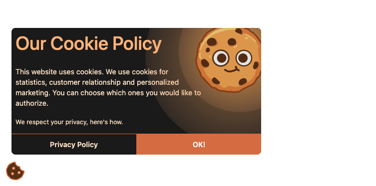

# Cookie Consent Popup
Simple popup designed and developed for a current position I work for. Accept cookies by clicking ok, which therefore adds 
your company name consent to true for the cookie. On page load the popup wont show if cookie was added. 

## Starting
Super simple, doesn't require npm start. Just open index.html file in your browser to play with it. Just download the repository with npm i or manually downloading. 

### Cookie popup

